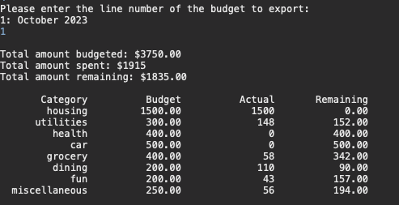
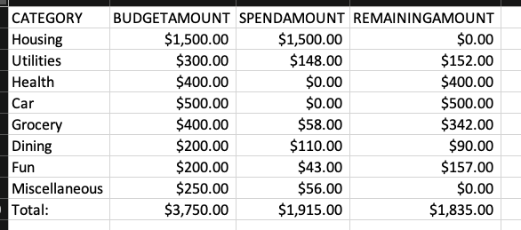
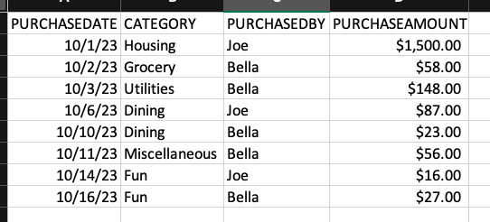

# Budget Tracker

## Overview

Budget Tracker allows users to keep track of their monthly household budget and purchases by category. After adding household members, users can add a monthly budget and any purchases they have made. Budget Tracker displays a user's household budget along with the total amounts spent and remaining, and users can also export a spreadsheet of their monthly budget and purchase information. 

### Budget Example

### Purchases Example

## Built With
-Java
-PostgreSQL
